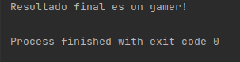

# Ejemplo del operador When

En este ejemplo se muestra diferentes usos de la expresión when. Se usa el tipo de objeto Any 
en la declaración de una variable. 

```
var value: Any = 1
    when (value) {
        is Int -> println("Valor del tipo Int "+ (value + 1).toString())
        is String -> println("El texto es $value")
        is Boolean -> if (value) print("es verdadero") else print("es falso")
    }

```
En este otro ejemplo se usa la expresión When sin argumentos.
```
fun main() {
var s="Me gusta el juego fifa"
var x= 700
var v = 0.0F

val text = when  {
s.contains("fifa") -> "es un gamer!"
x > 599 -> "es muy caro!"
s is String -> "Es un String!"
else -> ""
}
println("Resultado final $text")

}
```

Mostrando el siguiente resultado


